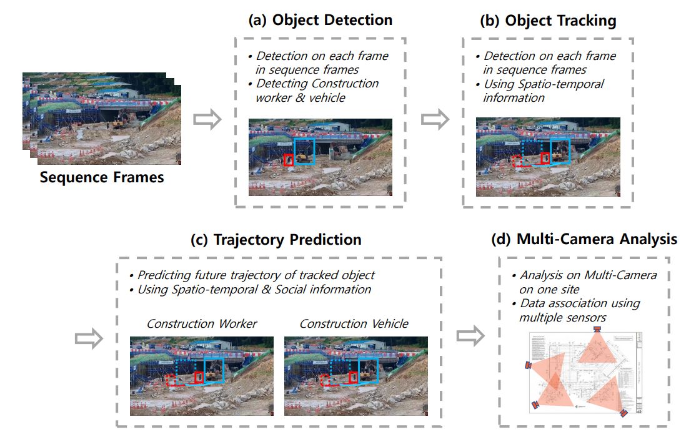
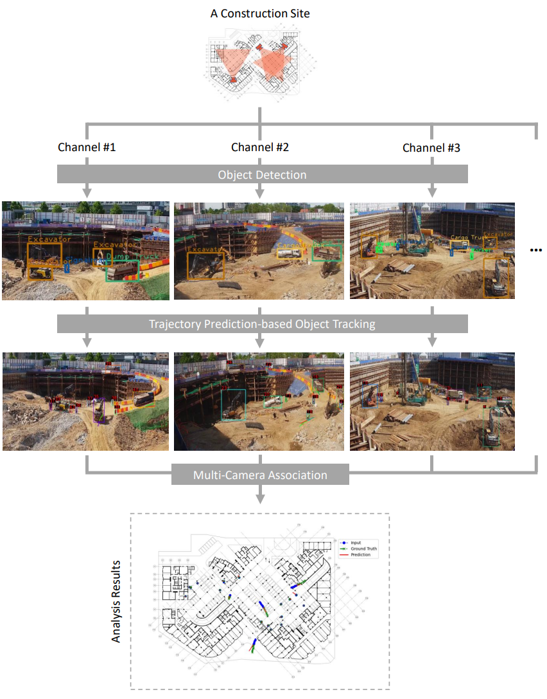

# Motion Prediction at Construction Sites: A Computer Vision Approach to Enhanced Safety Management and Automation in Multi-Camera Systems

This the official repo of the paper "Motion Prediction at Construction Sites: A Computer Vision Approach to Enhanced Safety Management and Automation in Multi-Camera Systems". The code will be publically opened after the paper is published.

Authors: Yuntae Jeon, Dai Quoc Tran, Almo Senja Kulinan, Taeheon Kim, Minsoo Park and Seunghee Park

## Proposed Approach

## Environment

We run on 2 NVIDIA A6000 GPUs.

- Linux or macOS
- Python 3.7+  (Python 3.8 in our envs)
- PyTorch 1.9+ (1.11.0 in our envs)
- CUDA 10.2+ (CUDA 11.3 in our envs)
- mmcv-full==1.7.1 ([MMCV](https://mmcv.readthedocs.io/en/latest/#installation))
